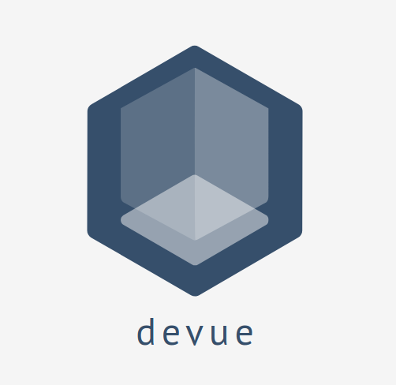

<p align="center">


  <h3 align="center">DeVue</h3>

  <p align="center">
    VueJS Playground build with NuxtJS
    <br />
    <a href="https://github.com/devolt5/devue"><strong>Explore the docs »</strong></a>
    <br />
    <br />
    <a href="https://github.com/devolt5/devue">View Demo (WIP)</a>
    ·
    <a href="https://github.com/devolt5/devue/issues">Report Bug</a>
    ·
    <a href="https://github.com/devolt5/devue/issues">Request Feature</a>
  </p>
</p>


This app is designed to help you get to know VueJS and Nuxt better. Also, it can be useful to implement the latest JS features.

I am open to suggestions and of course collaboration.  
Any feature may be included as long as it meets certain conditions.  

These include:  
1. The feature should be up to date in terms of packages
2. The feature should include unit tests.

The following features are planned:  

* The app should include a login page
* The app should be able to login to a web service that handles logins via JWT, currently planned is a Flask backend or an ExpressJS backend.
* The app should use simple CRUD operations against the webservice, for this it should use current technologies, i.e. Axios and Promises.
* The app should perform authentication and authorization taking into account all security aspects (CORS, XSS aspects, see OWASP)

The following tools should be used:  

* VueJS routing
* i18n (already implemented)
* Vuex Store

But the most important thing is that the app should serve as a **template/starting point** for further apps.   
Therefore there is always a focus on the architecture.

Questions that are still open:  

* To what extent should Typescript be used?
* Should JSS, SASS or CSS be used?

## Roadmap

See the [open issues](https://github.com/devolt5/devue/issues) for a list of proposed features (and known issues).

### Installation

```bash
# install dependencies
$ npm install

# serve with hot reload at localhost:3000
$ npm run dev

# build for production and launch server
$ npm run build
$ npm run start

# generate static project
$ npm run generate
```

For detailed explanation on how things work, check out the [documentation](https://nuxtjs.org).

## Special Directories in NuxtJS

You can create the following extra directories, some of which have special behaviors. Only `pages` is required; you can delete them if you don't want to use their functionality.

### `assets`

The assets directory contains your uncompiled assets such as Stylus or Sass files, images, or fonts.

More information about the usage of this directory in [the documentation](https://nuxtjs.org/docs/2.x/directory-structure/assets).

### `components`

The components directory contains your Vue.js components. Components make up the different parts of your page and can be reused and imported into your pages, layouts and even other components.

More information about the usage of this directory in [the documentation](https://nuxtjs.org/docs/2.x/directory-structure/components).

### `layouts`

Layouts are a great help when you want to change the look and feel of your Nuxt app, whether you want to include a sidebar or have distinct layouts for mobile and desktop.

More information about the usage of this directory in [the documentation](https://nuxtjs.org/docs/2.x/directory-structure/layouts).


### `pages`

This directory contains your application views and routes. Nuxt will read all the `*.vue` files inside this directory and setup Vue Router automatically.

More information about the usage of this directory in [the documentation](https://nuxtjs.org/docs/2.x/get-started/routing).

### `plugins`

The plugins directory contains JavaScript plugins that you want to run before instantiating the root Vue.js Application. This is the place to add Vue plugins and to inject functions or constants. Every time you need to use `Vue.use()`, you should create a file in `plugins/` and add its path to plugins in `nuxt.config.js`.

More information about the usage of this directory in [the documentation](https://nuxtjs.org/docs/2.x/directory-structure/plugins).

### `static`

This directory contains your static files. Each file inside this directory is mapped to `/`.

Example: `/static/robots.txt` is mapped as `/robots.txt`.

More information about the usage of this directory in [the documentation](https://nuxtjs.org/docs/2.x/directory-structure/static).

### `store`

This directory contains your Vuex store files. Creating a file in this directory automatically activates Vuex.

More information about the usage of this directory in [the documentation](https://nuxtjs.org/docs/2.x/directory-structure/store).


## Contributing

Contributions are what make the open source community such an amazing place to learn, inspire, and create. Any contributions you make are **greatly appreciated**.

1. Fork the Project
2. Create your Feature Branch (`git checkout -b feature/AmazingFeature`)
3. Commit your Changes (`git commit -m 'Add some AmazingFeature'`)
4. Push to the Branch (`git push origin feature/AmazingFeature`)
5. Open a Pull Request


## License

Distributed under the MIT License. See `LICENSE` for more information.

